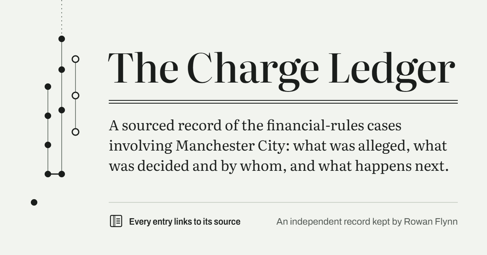
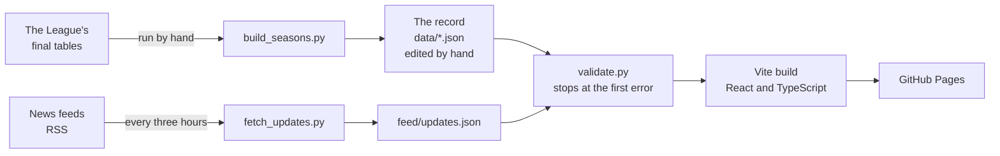

# The Charge Ledger

[](https://rowanflynnpilot.github.io/mancity-charge-ledger/)

A sourced record of the financial-rules cases involving Manchester City: what was alleged, what was decided and by whom, and what happens next. Every entry links to its source.

**Read it: <https://rowanflynnpilot.github.io/mancity-charge-ledger/>**

[](https://github.com/RowanFlynnPilot/mancity-charge-ledger/actions/workflows/deploy.yml)

An independent personal project by Rowan Flynn. It is not affiliated with any club, league or governing body.

## What it covers

Four cases, each drawn as its own lane on one timeline:

- UEFA's Financial Fair Play settlement with the club in 2014.
- UEFA's later case and the club's appeal to the Court of Arbitration for Sport.
- *Premier League v Manchester City*, the charges the League brought in February 2023, heard by an independent Commission.
- The arbitration over the League's Associated Party Transaction rules, which the club brought.

The site has five views:

| View | What it shows |
| --- | --- |
| Timeline | Every dated step in the four cases, with its sources. Filter to one case. |
| Charge ledger | The Commission's ten charges, each with its finding and the state of any appeal. A switch counts the same case the other way: the rules the League's charge statement cites, season by season. |
| Seasons | Where the club finished in each season the accounts charges cover, from the League's own final tables. |
| What's next | Steps that are due and have not happened. |
| Latest | Press headlines gathered from news feeds. Labelled as coverage, not as part of the record. |

Every entry has its own address, such as [`#1A`](https://rowanflynnpilot.github.io/mancity-charge-ledger/#1A) or [`#pl-core-decision`](https://rowanflynnpilot.github.io/mancity-charge-ledger/#pl-core-decision), so one item can be cited on its own.

## The rules it keeps

The subject is contested, so the project is built around a short set of editorial rules. They are enforced in code where they can be.

1. **Every finding is attributed.** The record never says what the club did in its own voice. It says what a named body found and links the document.
2. **Status lives in data, never in copy.** Each charge has a `finding` and an `appeal` field, and every label on the site is drawn from them. When an appeal changes an outcome, the fix is a data edit.
3. **The club's position travels with the findings.** Wherever findings are shown, the club's response and the appeal state are shown beside them. The validator refuses a case that has charges and no recorded response.
4. **Primary documents over press.** The charge ledger cites primary documents only, and the validator enforces it. Each source is labelled as a primary document or a press report.
5. **Redactions stay redacted.** Names removed from a published decision are not filled in from other reporting.
6. **A case the club brought is not styled as a charge against it.** The timeline draws it with open dots.
7. **The count is shown both ways.** The ledger follows the Commission's ten charges. A second view counts the League's statement rule by season, states the method, and sets the figure used in press coverage beside the result, attributed.
8. **Summaries are written for the record.** Nothing is pasted from a source.

## How it works



There is no database, no server and no login. The record is a handful of JSON files, and the site is built from them.

- **One contract, enforced twice.** [`src/types.ts`](src/types.ts) defines the shape of the data. [`pipeline/validate.py`](pipeline/validate.py) enforces the same rules on the files and stops at the first violation. It runs before every deploy, so a bad edit cannot reach the site.
- **The record and the coverage are kept apart.** A scheduled workflow reads three news feeds and keeps the headlines that mention the cases. They are stored in `feed/`, outside the record, and shown under their own label. A headline becomes part of the record only when a person writes a sourced entry for it.
- **The edit history is public.** The record changes only through commits to `data/`, and the site links to [that history](https://github.com/RowanFlynnPilot/mancity-charge-ledger/commits/main/data).
- **Published numbers are pinned.** The count of alleged breaches is computed from the transcribed statement, not typed in, and a test holds it at its published value so a data edit cannot change it unnoticed.
- **Every address is rendered before a deploy.** A test builds the whole page from the real data for each view and each entry, and follows every link within it. A data edit that would leave an entry unreachable fails the check.
- **Sources are checked weekly.** A workflow requests each document the record cites and fails if one has gone. A few sites refuse automated requests; those are listed for checking by hand.
- **No third-party requests.** Fonts are served from the site itself. There are no trackers and no analytics.
- **Built to be read in any setting.** Light and dark themes, a print stylesheet that prints each source's address, keyboard focus states throughout, and colour used for meaning in one place only, always with a text label beside it.

## Repository layout

| Path | What it is |
| --- | --- |
| `data/` | The record: cases, events, charges, pending items, the League's statement, funding figures, season table. |
| `feed/updates.json` | Press headlines. Written by the pipeline only. |
| `pipeline/` | The validator, the feed fetcher, the season-table builder, the link checker, and their tests. Python standard library only. |
| `src/` | The site: React components, the data contract, routing by URL fragment, one stylesheet. |
| `design/social-card.html` | Draws the image shown when a link to the site is shared. |
| `.github/workflows/` | `deploy.yml` checks, builds and publishes. `updates.yml` fetches the feeds on a schedule. `links.yml` checks the cited sources weekly. |
| `CLAUDE.md` | The working brief: editorial rules, data rules and design decisions in full. |

## Run it

The pipeline needs Python 3.14 and nothing else. The site needs Node 24.

```
python pipeline/validate.py              # check the record
python -m unittest discover pipeline     # pipeline tests
npm install
npm test                                 # site tests
npm run dev                              # local site
npm run build                            # typecheck, then build to dist/
```

## Corrections

If an entry is wrong, out of date or missing a better source, [open an issue](https://github.com/RowanFlynnPilot/mancity-charge-ledger/issues) and link the document that shows it.

## Licence

- The code is under the [MIT licence](LICENSE).
- The record in `data/` is under [CC BY 4.0](LICENSE-DATA.md). Reuse it with credit.
- The documents the record cites, and the headlines in `feed/`, belong to their publishers.

## How it was built

The project was built with [Claude Code](https://claude.com/claude-code). [`CLAUDE.md`](CLAUDE.md) is the brief each working session starts from, which is why the editorial rules and design decisions are written down in one place.
